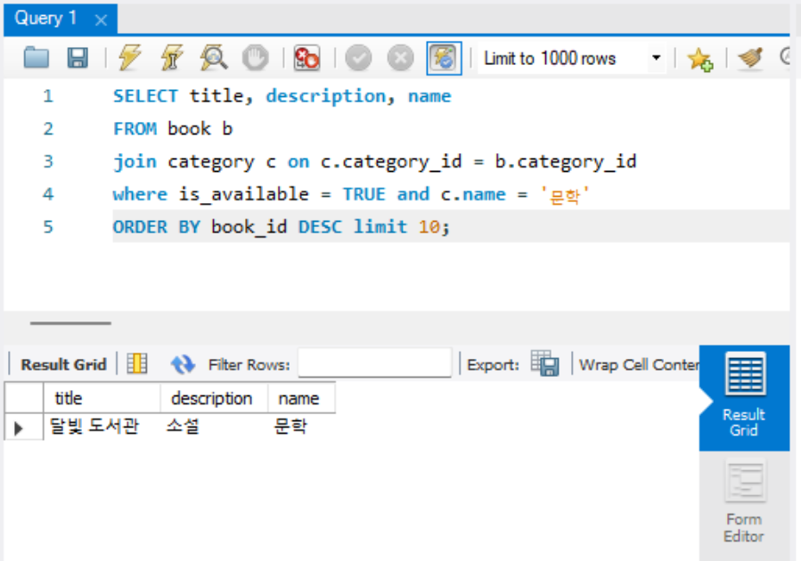
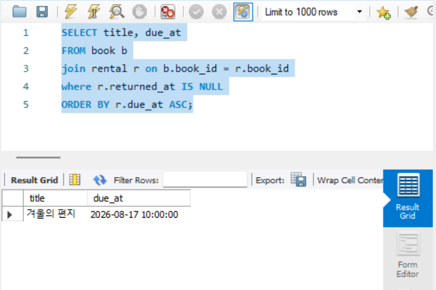

1. 미션 1. 문학 카테고리의 대여 가능한 도서를 최신순으로 10개 조회합니다.
    - 미션 1 결과에는 책 제목, 설명, 카테고리 이름을 포함합니다.
    ```sql
    SELECT title, description, name
    FROM book b
    join category c 
        on c.category_id = b.category_id
    where is_available = TRUE 
        and c.name = '문학'
    ORDER BY book_id DESC limit 10;
    ```
    
    - 미션 2. 특정 사용자가 아직 반납하지 않은 책을 반납 예정일 순으로 조회합니다.
    ```sql
    SELECT title, due_at
    FROM book b
    join rental r on b.book_id = r.book_id
    where r.returned_at IS NULL
    ORDER BY r.due_at ASC;
    ```
    
2. 미션 2 결과에는 책 제목, 대여일, 반납 예정일을 포함합니다.
    - 미션 3. 특정 책의 태그 목록과 특정 사용자의 좋아요 여부를 조회합니다.
    ```sql
    SELECT
    t.name AS tag_name,
    CASE
        WHEN bl.user_id IS NOT NULL THEN TRUE
        ELSE FALSE
    END AS is_liked
    FROM book b
    JOIN book_tag bt
        ON b.book_id = bt.book_id
    JOIN tag t
        ON bt.tag_id = t.tag_id
    LEFT JOIN book_like bl
        ON b.book_id = bl.book_id
        AND bl.user_id = 1
    WHERE b.book_id = 10
    ORDER BY t.name ASC;
    ```
    - 각 쿼리에서 기준 테이블, JOIN한 이유, WHERE 조건, 정렬·목록 기준을 설명합니다.
    기준 테이블: book- 특정 책을 기준으로 태그와 좋아요 여부를 조회하기 때문

    JOIN book_tag- 책과 태그의 다대다 관계를 연결하기 위해 사용

    JOIN tag- 실제 태그 이름을 가져오기 위해 사용

    LEFT JOIN book_like- 특정 사용자가 해당 책에 좋아요를 눌렀는지 확인하기 위해 사용
    - 좋아요가 없어도 책의 태그는 조회되어야 하므로 LEFT JOIN

    WHERE b.book_id = 10- 조회하려는 특정 책만 선택

    bl.user_id = 3- 특정 사용자의 좋아요만 확인

    ORDER BY t.name ASC- 태그 이름 기준 오름차순 정렬
    - 확장. 자신의 1주차 ERD에서 같은 방식으로 화면 조회 요구사항 1개와 SQL을 작성합니다.