# 4주차 미션: Raw SQL → JPA 리팩터링

## 핵심 코드

### Entity
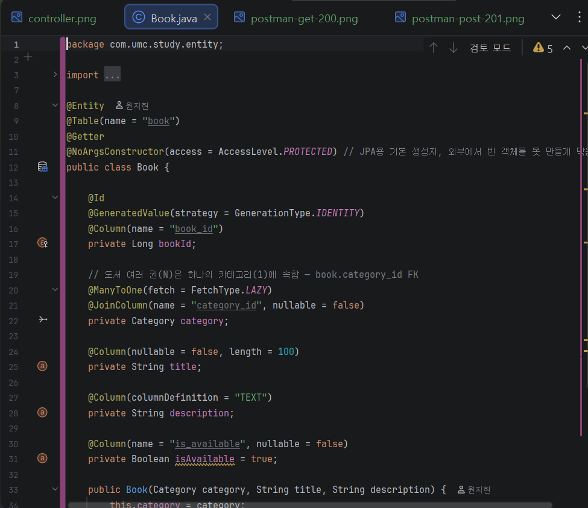
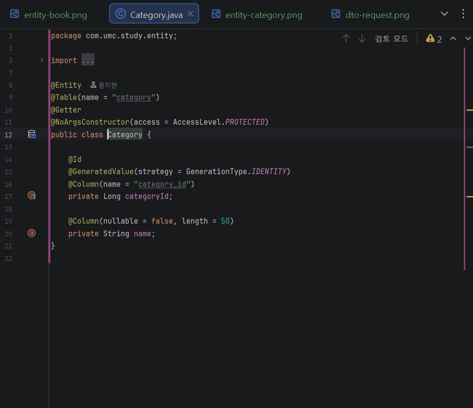

### DTO
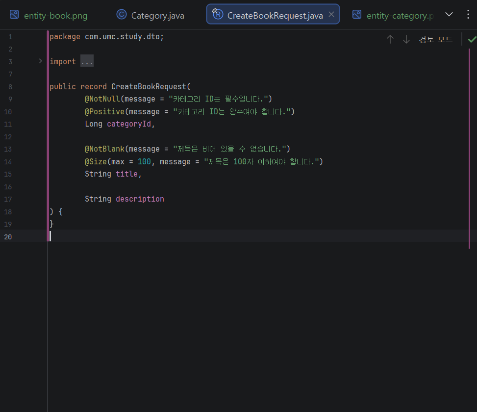
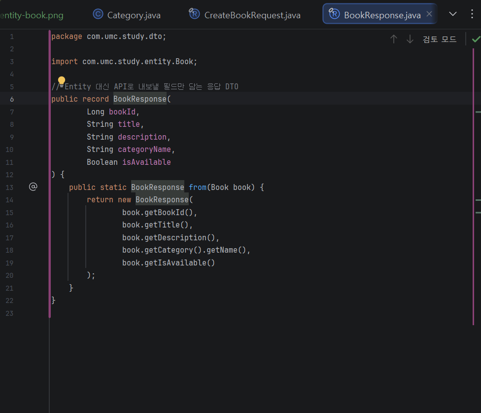

### Repository
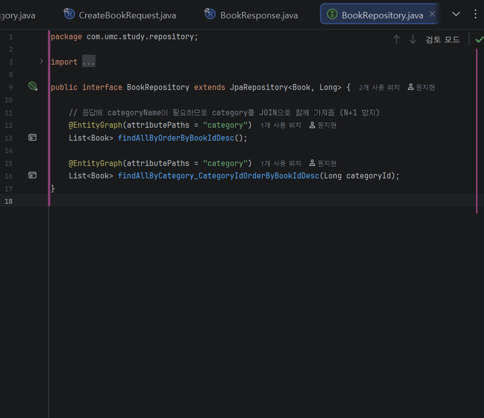

### Service
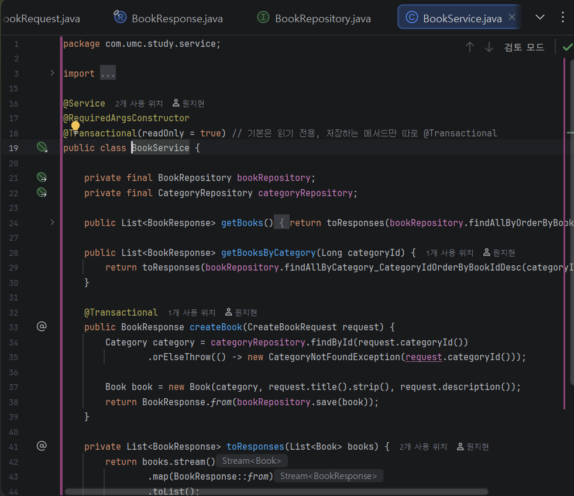

### Controller
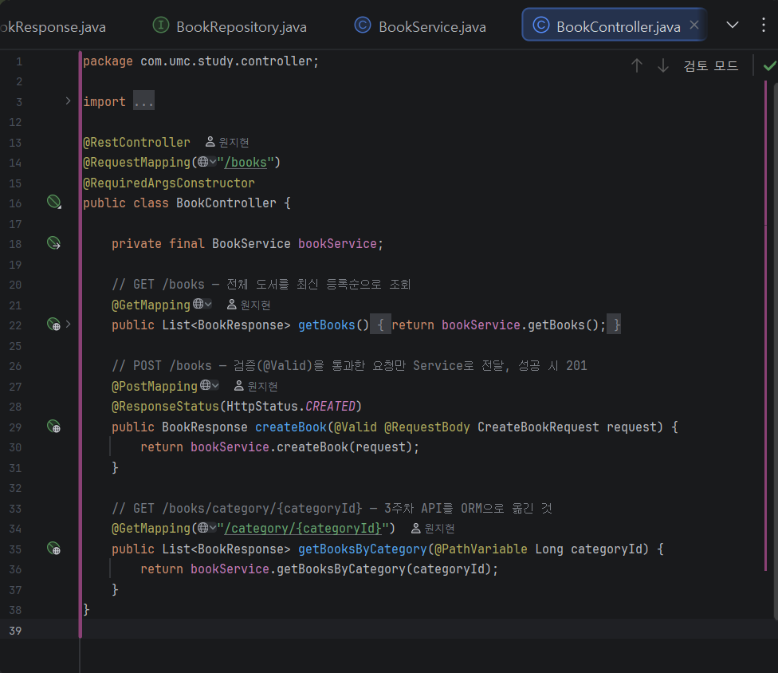

## Postman 실행 결과

### GET /books → 200
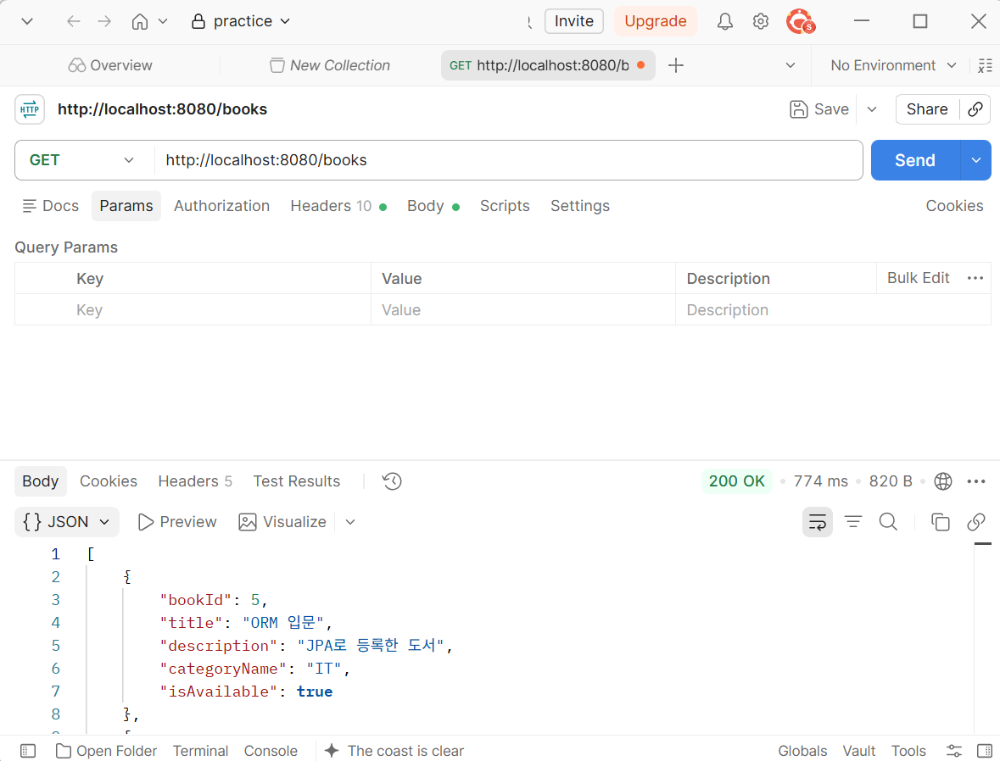

### POST /books → 201
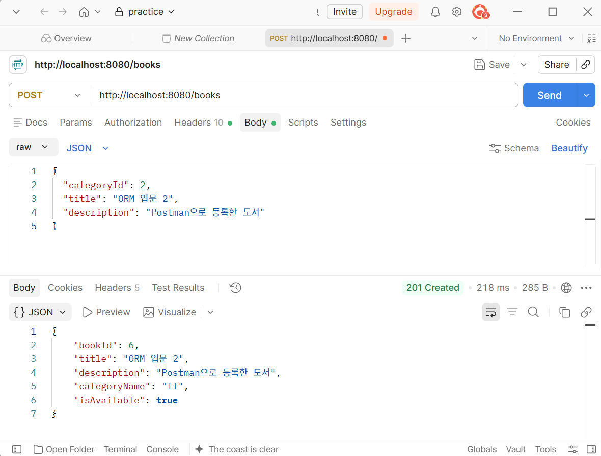

### 없는 카테고리 → 404
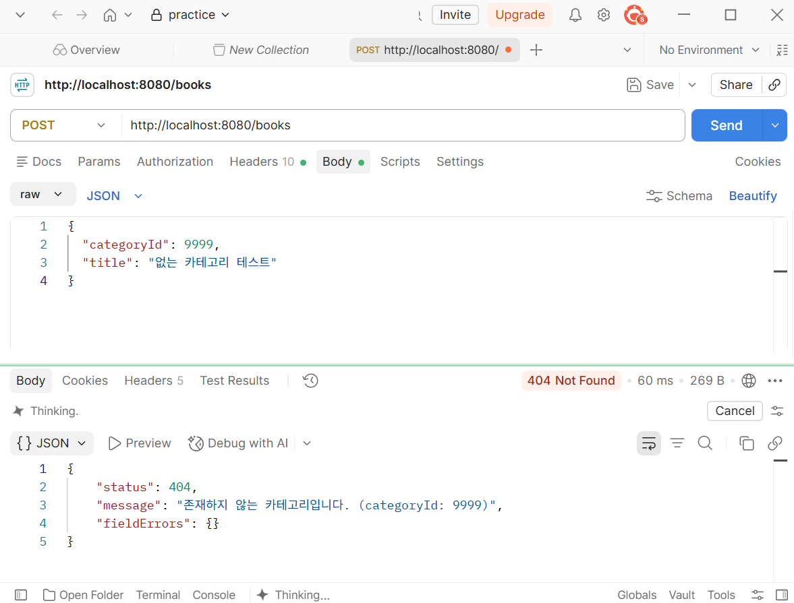

### 빈 제목 → 400
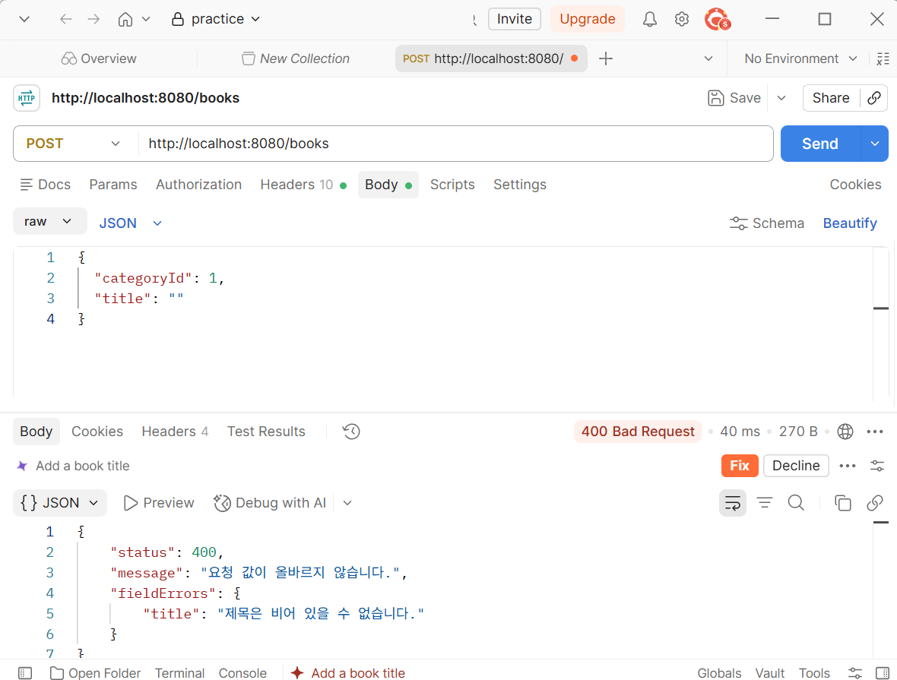

## 3주차 Raw SQL 방식과 비교해 바뀐 점

3주차에는 SQL을 문자열로 직접 쓰고 물음표 순서까지 맞춰야 했는데, 이번에는 엔티티와 JpaRepository를 써서 SQL을 직접 쓸 일이 없어졌습니다. 예전에는 Map으로 주고받아서 category_id 같은 DB 컬럼명이 응답에 그대로 나왔지만, 지금은 DTO로 필요한 값만 골라서 보냅니다. 또 빈 제목이나 없는 카테고리가 들어와도 그냥 DB까지 갔었는데, 이제는 @Valid와 예외 처리로 400, 404를 돌려줍니다.

## 실행 결과 검증

Postman으로 GET은 200, 정상 등록은 201, 없는 카테고리는 404, 빈 제목은 400이 나오는 것을 확인해서 요구사항대로 동작합니다.
