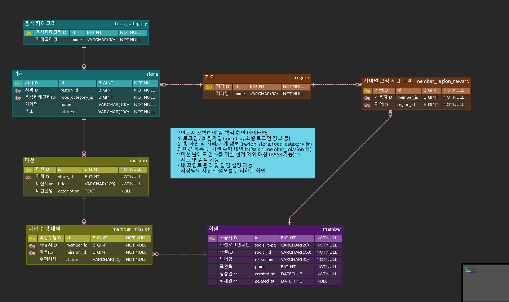

# 1주차 백엔드 - 요구사항을 데이터로 바꾸기

## 목차
1. [RDB vs NoSQL](#1-rdb-vs-nosql)
2. [ERD 작성 — 언제, 어떻게?](#2-erd-작성--언제-어떻게)
3. [예시 실습 — 온라인 도서 대여 시스템](#3-예시-실습--온라인-도서-대여-시스템)
4. [미션 — 리워드 서비스 ERD 설계](#4-미션--리워드-서비스-erd-설계)
5. [트러블슈팅 / 회고](#5-트러블슈팅--회고)

---

## 1. RDB vs NoSQL

대부분의 서비스가 메인 DB로 RDB(MySQL/PostgreSQL 등)를 쓰는 이유는 크게 4가지 무기 때문이다.

1. **SSOT(단일 진실 공급원) & 중복 차단**
   회원 정보를 주문마다 통째로 복사해서 저장하면, 정보가 바뀔 때마다 여러 곳을 다 고쳐야 하고 어디가 최신인지 혼란이 생긴다. `member`/`order` 테이블을 분리(정규화)해서 이 문제를 근본적으로 차단한다.
2. **데이터 무결성 강제**
   도메인 무결성(타입·NOT NULL), 개체 무결성(PK·UNIQUE), 참조 무결성(FK)을 DB 엔진 자체가 강제한다. 백엔드 코드에 버그가 있어도 DB가 마지막 방어선 역할을 한다.
3. **ACID 트랜잭션**
   결제처럼 여러 단계로 이루어진 작업을 하나의 단위로 묶어, 중간에 실패하면 전부 롤백(원자성)시킨다. "돈만 빠지고 주문은 안 되는" 사고를 막아준다.
4. **JOIN**
   여러 테이블로 쪼개 저장해도, 필요할 땐 SQL 한 줄로 다시 합쳐서 조회할 수 있다.

반면 NoSQL은 스키마가 유연하고 조인 없이 빠르게 읽고 쓸 수 있어서, 정형화되지 않은 데이터나 초고속 처리가 필요한 곳(캐싱 등)에 적합하다. 실무에서는 보통 SQL을 메인으로 쓰고 Redis 같은 NoSQL을 보조로 조합하는 경우가 많다.

## 2. ERD 작성 — 언제, 어떻게?

- **시점**: 프로젝트 시작 직후, 와이어프레임이 나오자마자 설계 시작
- **ERD 구성 4요소**: ① 테이블 간 관계 ② 테이블별 속성 ③ 속성별 제약조건 ④ (선택) 주석
- **작성 규칙 2가지**
  - 테이블/속성명 스타일 통일 (예: snake_case)
  - PK 이름은 항상 `테이블명+id` (예: `member` 테이블 → PK `id`, FK로 참조할 때는 `member_id`)

## 3. 예시 실습 — 온라인 도서 대여 시스템

- **1:N 관계 처리**: 회원 탈퇴 시 실제로 지우지 않고 `deleted_at` 또는 `is_inactive` 컬럼으로 표시만 해두는 Soft Delete를 사용한다. 탈퇴 복구, 탈퇴한 사용자가 남긴 게시글/댓글을 살려두기 위함이다.
- **N:M 관계 → 매핑 테이블**: "한 사용자가 여러 책을 대여" + "한 책을 여러 사용자가 대여"처럼 양방향 다대다 관계가 생기면, 중간에 매핑 테이블(예: `member_book`)을 두고 양쪽 PK를 각각 FK로 가지게 한다. 책-해시태그, 책 좋아요도 같은 원리다.
- **팁**: 좋아요 기능은 나중에 "차단한 사용자의 좋아요는 제외" 같은 확장 요구사항이 생기기 쉬우므로 처음부터 중간 테이블로 구현하는 것이 안전하다. 반대로 읽기 성능이 우선이고 정합성이 덜 중요하면 책 테이블에 좋아요 수만 캐싱해두는 방법도 있다.

## 4. 미션 — 리워드 서비스 ERD 설계

> 요구사항: 각 지역별로 가게들이 있으며, 가게를 방문하는 미션을 해결하고 포인트를 모으는 리워드 서비스 (지역당 미션 10개 클리어 시 1,000P)

**필수 반영**: 로그인/회원가입, 홈 화면 및 지역/가게 정보, 미션 목록 및 수행 내역
**설계 제외**: 지도/검색, 포인트 관리/알림, 사장님 점포 관리

### 4-1. 테이블 도출

| 화면/기능 | 필요한 테이블 |
|---|---|
| 로그인/회원가입 (소셜 로그인) | `member` |
| 홈 화면 - 지역 목록 | `region` |
| 가게 정보 (지역별, 카테고리별) | `store`, `food_category` |
| 미션 목록 | `mission` |
| 미션 수행 내역 | `member_mission` (N:M 매핑) |
| 지역별 10개 클리어 시 1,000P 지급 | `member_region_reward` |

### 4-2. `member_region_reward`를 따로 둔 이유

"지역당 미션 10개 클리어 시 1,000P"는 `member_mission`을 COUNT해서 매번 계산할 수도 있지만, **이미 지급했는지 여부**를 저장해두지 않으면 중복 지급될 위험이 있다. 그래서 "이 회원이 이 지역 보상을 이미 받았다"는 사실 자체를 별도 테이블로 기록해두는 것이 안전하다.

### 4-3. 관계 정리

- `region` 1 : N `store`
- `food_category` 1 : N `store`
- `store` 1 : N `mission`
- `member` N : M `mission` → `member_mission`
- `member` N : M `region` → `member_region_reward`

### 4-4. DDL (MySQL)

```sql
CREATE TABLE region (
    id BIGINT AUTO_INCREMENT PRIMARY KEY,
    name VARCHAR(50) NOT NULL,
    created_at DATETIME NOT NULL DEFAULT CURRENT_TIMESTAMP,
    updated_at DATETIME NOT NULL DEFAULT CURRENT_TIMESTAMP ON UPDATE CURRENT_TIMESTAMP,
    deleted_at DATETIME NULL
);

CREATE TABLE food_category (
    id BIGINT AUTO_INCREMENT PRIMARY KEY,
    name VARCHAR(50) NOT NULL,
    created_at DATETIME NOT NULL DEFAULT CURRENT_TIMESTAMP,
    updated_at DATETIME NOT NULL DEFAULT CURRENT_TIMESTAMP ON UPDATE CURRENT_TIMESTAMP,
    deleted_at DATETIME NULL
);

CREATE TABLE member (
    id BIGINT AUTO_INCREMENT PRIMARY KEY,
    social_type VARCHAR(20) NOT NULL,
    social_id VARCHAR(100) NOT NULL,
    nickname VARCHAR(30) NOT NULL,
    point BIGINT NOT NULL DEFAULT 0,
    created_at DATETIME NOT NULL DEFAULT CURRENT_TIMESTAMP,
    updated_at DATETIME NOT NULL DEFAULT CURRENT_TIMESTAMP ON UPDATE CURRENT_TIMESTAMP,
    deleted_at DATETIME NULL,
    CONSTRAINT uq_member_social UNIQUE (social_type, social_id)
);

CREATE TABLE store (
    id BIGINT AUTO_INCREMENT PRIMARY KEY,
    region_id BIGINT NOT NULL,
    food_category_id BIGINT NOT NULL,
    name VARCHAR(100) NOT NULL,
    address VARCHAR(200) NOT NULL,
    created_at DATETIME NOT NULL DEFAULT CURRENT_TIMESTAMP,
    updated_at DATETIME NOT NULL DEFAULT CURRENT_TIMESTAMP ON UPDATE CURRENT_TIMESTAMP,
    deleted_at DATETIME NULL,
    CONSTRAINT fk_store_region FOREIGN KEY (region_id) REFERENCES region(id),
    CONSTRAINT fk_store_food_category FOREIGN KEY (food_category_id) REFERENCES food_category(id)
);

CREATE TABLE mission (
    id BIGINT AUTO_INCREMENT PRIMARY KEY,
    store_id BIGINT NOT NULL,
    title VARCHAR(100) NOT NULL,
    description TEXT NULL,
    created_at DATETIME NOT NULL DEFAULT CURRENT_TIMESTAMP,
    updated_at DATETIME NOT NULL DEFAULT CURRENT_TIMESTAMP ON UPDATE CURRENT_TIMESTAMP,
    deleted_at DATETIME NULL,
    CONSTRAINT fk_mission_store FOREIGN KEY (store_id) REFERENCES store(id)
);

CREATE TABLE member_mission (
    id BIGINT AUTO_INCREMENT PRIMARY KEY,
    member_id BIGINT NOT NULL,
    mission_id BIGINT NOT NULL,
    status VARCHAR(20) NOT NULL DEFAULT 'IN_PROGRESS',
    completed_at DATETIME NULL,
    created_at DATETIME NOT NULL DEFAULT CURRENT_TIMESTAMP,
    CONSTRAINT fk_member_mission_member FOREIGN KEY (member_id) REFERENCES member(id),
    CONSTRAINT fk_member_mission_mission FOREIGN KEY (mission_id) REFERENCES mission(id),
    CONSTRAINT uq_member_mission UNIQUE (member_id, mission_id)
);

CREATE TABLE member_region_reward (
    id BIGINT AUTO_INCREMENT PRIMARY KEY,
    member_id BIGINT NOT NULL,
    region_id BIGINT NOT NULL,
    rewarded_at DATETIME NOT NULL DEFAULT CURRENT_TIMESTAMP,
    CONSTRAINT fk_reward_member FOREIGN KEY (member_id) REFERENCES member(id),
    CONSTRAINT fk_reward_region FOREIGN KEY (region_id) REFERENCES region(id),
    CONSTRAINT uq_member_region_reward UNIQUE (member_id, region_id)
);
```

**설계 포인트**
- `member_mission`, `member_region_reward`에 `UNIQUE (member_id, mission_id/region_id)`를 걸어, 같은 미션/지역에 중복 데이터가 쌓이는 것을 DB 레벨에서 방지했다.
- `member.social_type + social_id`도 UNIQUE로 묶어 동일 소셜 계정으로 중복 가입되지 않도록 했다.
- 마스터/이력성 데이터의 타임스탬프 컬럼은 "값이 변하는가", "삭제 시 흔적을 남겨야 하는가" 기준으로 필요 여부를 판단했다. (`rewarded_at`, `member`의 `created_at`/`deleted_at`은 각각 비즈니스 값·Soft Delete 요건상 유지)

### 4-5. ERD




