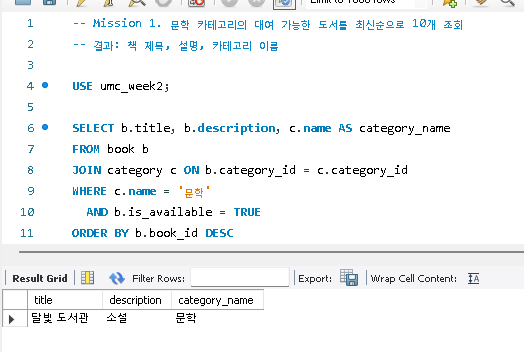
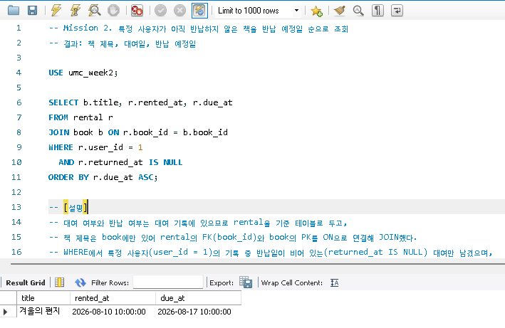
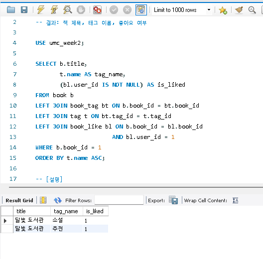
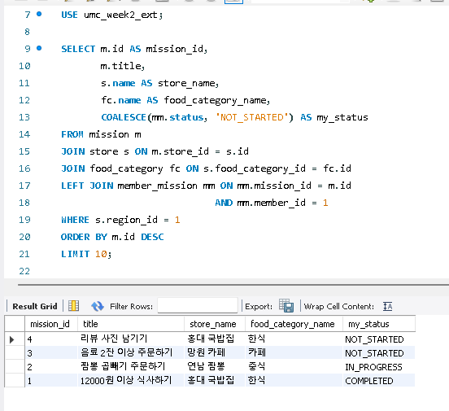

# 2주차 - SQL로 데이터 다루기

1주차에 설계한 ERD를 MySQL 테이블과 더미 데이터로 구현하고, 화면 요구사항을 SQL 조회 쿼리로 바꾸는 실습입니다.

## 파일 구성

| 파일 | 내용 |
|---|---|
| `mission1.sql` | 문학 카테고리의 대여 가능 도서 최신순 10개 |
| `mission2.sql` | 특정 사용자의 미반납 도서 (반납 예정일 순) |
| `mission3.sql` | 특정 책의 태그 목록 + 특정 사용자의 좋아요 여부 |
| `mission4.sql` | 확장: 1주차 리워드 서비스 ERD - 선택한 지역의 미션 목록 + 내 수행 상태 |
| `*_result.png` | 각 미션 실행 결과 캡처 |
| `01_schema 및 02_seed 실행 결과.png` | 공통 스키마·더미 데이터 실행 확인 |
| `erd 경로 설명.png` | 확장 미션의 JOIN 경로를 표시한 1주차 ERD |

공통 실습(미션 1~3)은 워크북에서 제공된 `01_schema.sql`, `02_seed.sql`을 실행한 `umc_week2` 데이터베이스에서, 확장 미션(미션 4)은 1주차 ERD로 만든 `umc_week2_ext` 데이터베이스에서 실행했습니다.

## 요구사항 분해 방식

요구사항 문장을 아래 5칸으로 먼저 나눈 뒤 SQL로 옮겼습니다.

| 칸 | SQL |
|---|---|
| 결과 | SELECT |
| 테이블 | FROM |
| 관계 | JOIN ... ON |
| 조건 | WHERE |
| 정렬/범위 | ORDER BY / LIMIT |

## 미션 요약

| 미션 | 기준 테이블 | JOIN 경로 | 핵심 포인트 |
|---|---|---|---|
| 1 | book | book -> category | 카테고리 이름이 category에만 있어 FK로 연결 |
| 2 | rental | rental -> book | 미반납 조건은 `returned_at IS NULL` (= NULL 불가) |
| 3 | book | book -> book_tag -> tag, book -> book_like | N:M은 중간 테이블 경유, 좋아요는 LEFT JOIN + 회원 조건을 ON에 |
| 4 (확장) | mission | mission -> store -> food_category, mission <- member_mission | 지역 필터는 store.region_id로 충분해 region은 JOIN하지 않음 |

각 SQL 파일 하단에 설명, 실행 결과, 검증 문장을 주석으로 기록했습니다.

## 실행 결과

### 실습 준비 (01_schema.sql, 02_seed.sql 실행)

### 미션 1

### 미션 2

### 미션 3

### 미션 4 (확장)

## 트러블 슈팅

1. `WHERE returned_at = NULL`이 오류 없이 0건 반환 -> NULL 비교는 UNKNOWN이므로 `IS NULL` 사용
2. LEFT JOIN 뒤 회원 조건을 WHERE에 두어 책 자체가 사라짐 -> 연결 조건은 ON 절로 이동
3. 확장 미션 DDL이 ERDCloud 최종 ERD와 불일치 -> 컬럼 대조 후 DDL 재작성
